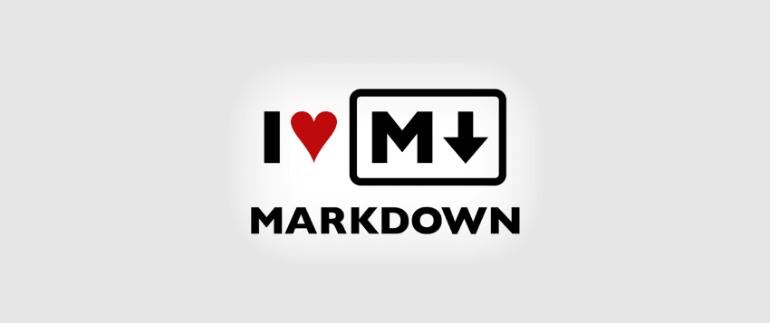

# MarkDown Tutorial
  
<br/>
Markdown is a lightweight markup language that is often used for formatting and styling plain text documents. It was created by John Gruber and Aaron Swartz in 2004, and its design is geared toward simplicity and ease of use. Markdown is commonly used for creating content for the web, including documentation, README files in software repositories, and more. It is widely supported on various platforms and can be easily converted to HTML or other formats  <br/>
<br/>
You need just to Study the `README.md` file in this repo.  
You can Learn more  ----> [MarkDown](https://www.markdownguide.org/)  

If you find this repository useful, please consider giving it a ⭐ star. Your support is greatly appreciated!
 
## Headers
# Hi this is a header 1  👋
## Hi this is a header 2 👋
### Hi this is a header 3 👋
#### Hi this is a header 4 👋
##### Hi this is a header 5 👋
###### Hi this is a header 6 👋 

## Paragraph
this is a paragraph
<p style="text-align:center">Center text</p>  
<p style="color:red">Red Text.</p>
  
## Italic/Bold
*This is an italic text.*  
__This is a bold text.__

## Ordered / Unordered List
This is an ordered list
 1. this is a list
 2. this the second row

This is an unordered list
 - this is a unordered list
 - this is the second row of it

Nested list

 1. parent 
    - this is the first child
        1. this the child
            - this is child
    - this is the second child
1. parent 
   - this is the first child
   - this is the second child

## Picture


## Video
[](https://www.youtube.com/watch?v=qRSb299awB0)  

You need just to change the id which in this case is : `qRSb299awB0`

## link
[The personal website](https://cv.arashalghasi.me)    
<https://www.google.com>

## BlockQuote
> this is the start of the blockquote 
>
>
>
>I want to make this **this** bold
>
>>the is the nested blockquote
>
>this is the end of the blockquote

## Escape Character
this is how to escape character   **this**   -> \*\*this\*\*

## Emphasis
`this is an Emphasized`

## BlockCode
```Cpp
#include <iostream>

int main() {
    std::cout << "Hello, World!" << std::endl;
    return 0;
}


```

## Table
| Name          | Major                | Age     |
| --------      | -------              | ------- |
| Arash Alghasi | Computer Engineer    | 28      |

## FootNote
Here's a simple footnote,[^1] and here's a longer one.[^bignote]

[^1]: This is the first footnote.

[^bignote]: Here's one with multiple paragraphs and code.

    Indent paragraphs to include them in the footnote.

    `{ my code }`

    Add as many paragraphs as you like.

## Strikethrough/ Highlight
~~strikethrough~~  
<mark> Highlight </mark>  
==Highlight==

## Task List
 - [ ] Not Checked
 - [x] Checked
 - [ ] Not Checked

<!-- ### styled head line to CSS id {#id}
### styled head line to css class {.id} -->

## Emoji
Copy the emoji from [EmojiPedia](https://emojipedia.org/robot)  🤖 
## Hidden Text
there is a hidden text go and find it out in the code

[Good job you found it!]: #

<!-- this is an html comment which we can see to put it as well in the md file -->

# Line
this 
is 
all 
one 
line 

these  
are   
in  
seperate   
lines

because at the first one used one spaces after every word but in the second
one i used two spaces

## Subscript / Superscript
H~2~O  
H<sub>2</sub>O  
X^2^  
X<sup>2</sup>

## Simbols
Copyright (©) — &copy;  
Registered trademark (®) — &reg;  
Trademark (™) — &trade;  
Euro (€) — &euro;  
Left arrow (←) — &larr;  
Up arrow (↑) — &uarr;  
Right arrow (→) — &rarr;  
Down arrow (↓) — &darr;  
Degree (°) — &#176;  
Pi (π) — &#960;  